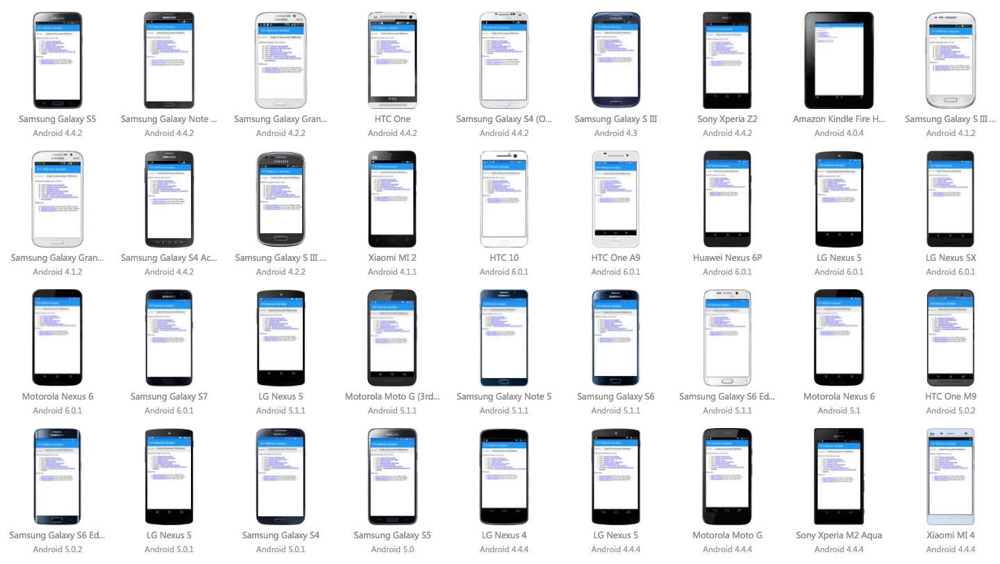

# XamarinAppCenter_WebviewSamples
Here are a series of samples that illustrate how to use Xamarin.UITest APIs to interact with web views in a mobile app.

- Textboxes - [UI Test Code](https://github.com/mattregul/XamarinAppCenter_WebviewSamples/blob/master/Code/UITests/Tests.cs#L161) || [HTML](https://github.com/mattregul/XamarinAppCenter_WebviewSamples/blob/master/HTML/textboxes.html)
- Buttons - [UI Test Code](https://github.com/mattregul/XamarinAppCenter_WebviewSamples/blob/master/Code/UITests/Tests.cs#L198) || [HTML](https://github.com/mattregul/XamarinAppCenter_WebviewSamples/blob/master/HTML/buttons.html)
- Dropdowns / Select Menus - [UI Test Code](https://github.com/mattregul/XamarinAppCenter_WebviewSamples/blob/master/Code/UITests/Tests.cs#L224) || [HTML](https://github.com/mattregul/XamarinAppCenter_WebviewSamples/blob/master/HTML/dropdownmenus.html)
- Date Picker - [UI Test Code](https://github.com/mattregul/XamarinAppCenter_WebviewSamples/blob/master/Code/UITests/Tests.cs#L276) || [HTML](https://github.com/mattregul/XamarinAppCenter_WebviewSamples/blob/master/HTML/datepicker.html)
- Ajax/Async Requests - [UI Test Code](https://github.com/mattregul/XamarinAppCenter_WebviewSamples/blob/master/Code/UITests/Tests.cs#L327) || [HTML](https://github.com/mattregul/XamarinAppCenter_WebviewSamples/blob/master/HTML/ajaxrequest.html)
- Radio Buttons - [UI Test Code](https://github.com/mattregul/XamarinAppCenter_WebviewSamples/blob/master/Code/UITests/Tests.cs#L379) || [HTML](https://github.com/mattregul/XamarinAppCenter_WebviewSamples/blob/master/HTML/radiogroup.html)
- Checkboxes - [UI Test Code](https://github.com/mattregul/XamarinAppCenter_WebviewSamples/blob/master/Code/UITests/Tests.cs#L405) || [HTML](https://github.com/mattregul/XamarinAppCenter_WebviewSamples/blob/master/HTML/checkboxgroup.html)
- jQuery's Color Picker - [UI Test Code](https://github.com/mattregul/XamarinAppCenter_WebviewSamples/blob/master/Code/UITests/Tests.cs#L438) || [HTML](https://github.com/mattregul/XamarinAppCenter_WebviewSamples/blob/master/HTML/colorpicker.html)
- jQuery's Number Spinner - [UI Test Code](https://github.com/mattregul/XamarinAppCenter_WebviewSamples/blob/master/Code/UITests/Tests.cs#L469) || [HTML](https://github.com/mattregul/XamarinAppCenter_WebviewSamples/blob/master/HTML/spinner.html)
- Scrollable Agreement / Div - Coming Soon! - Code || HTML
- Embedded Video - [UI Test Code](https://github.com/mattregul/XamarinAppCenter_WebviewSamples/blob/master/Code/UITests/Tests.cs#L525) || [HTML](https://github.com/mattregul/XamarinAppCenter_WebviewSamples/blob/master/HTML/embeddedvideo.html)

<!-- # Additional Samples, Docs, & Tools
- ( Tool ) [Xamarin Test Recorder](https://www.xamarin.com/test-cloud/recorder)
- ( Doc ) [Xamarin.UITest Web Views](https://developer.xamarin.com/guides/testcloud/uitest/working-with/webviews/)
- ( Doc ) [Xamarin.UITest](https://developer.xamarin.com/guides/testcloud/uitest/)
- ( Doc ) [Xamarin.UITest Cheat Sheet](https://developer.xamarin.com/guides/testcloud/uitest/cheatsheet/)
- ( Doc ) [Working With the REPL](https://developer.xamarin.com/guides/testcloud/uitest/working-with/repl/)
- ( Samples ) [Xamarin Test Cloud Samples](https://github.com/xamarin/test-cloud-samples)
- ( Samples ) [Cross-platform BDD with Cucumber and Calabash](https://github.com/calabash/x-platform-example) -->

# References
- [jQuery Framework](https://jquery.com/) *(used in each HTML sample)*
- [jQueryUI Framework](https://jqueryui.com/) *(used in each HTML sample)*
- [Github Developer API](https://developer.github.com/v3/) *(used in Ajax/Async test)*

# Build status

